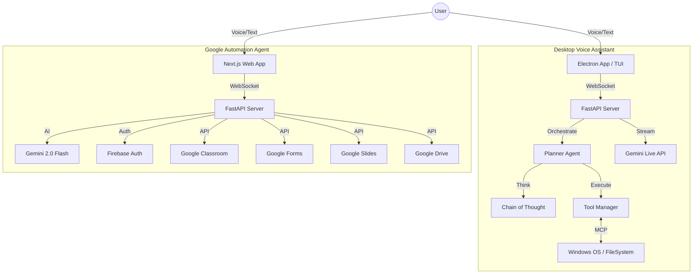

<div align="center">

# Echo
### The Future of Desktop Computing

[](https://python.org)
[](https://www.electronjs.org/)
[](https://deepmind.google/technologies/gemini/)
[](https://modelcontextprotocol.io/introduction)
[](./LICENSE)

<br/>

**Echo is a multimodal AI agent that lives on your desktop.**  
It doesn't just chat—it *acts*. Echo ships as **two powerful agents in one**:

| 🖥️ Desktop Voice Assistant | ☁️ Google Automation Agent |
|---|---|
| Control your OS with natural voice commands | Automate Google Workspace with AI |
| Launch apps, type text, navigate GUIs | Manage Classroom, Drive, Forms & Slides |
| MCP-powered tool execution | Voice & text chat interface |

Using advanced speech-to-speech models and the Model Context Protocol (MCP), Echo listens to your voice, understands your intent, and gets things done—locally or in the cloud.

[Features](#-features) • [Installation](#-quick-start) • [Architecture](#-architecture) • [Documentation](#-documentation)

</div>

---

##  What is Echo?

Echo bridges the gap between conversational AI and real-world action. Most assistants are trapped in a browser tab. Echo operates across **two complementary modes**:

### 🖥️ Desktop Voice Assistant
Echo integrates directly with your operating system, allowing it to:
*   ** See** your screen and understand context.
*   ** Hear** your voice with sub-second latency (Real-time API).
*   ** Act** on your apps, files, and workflows using specialized tools.

Speak a command like *"Open VS Code, create a new file and write a Python hello world"* and watch Echo execute every step autonomously.

### ☁️ Google Automation Agent
Echo connects to your Google Workspace services, allowing it to:
*   ** Teach** — manage Google Classroom courses, students, and assignments.
*   ** Create** — generate Forms, quizzes, and Slides presentations with AI.
*   ** Coordinate** — send bulk invitations and manage rosters automatically.

---

##  Features

###  Native Voice Interaction
Speak naturally. Echo uses **Gemini 2.0 Flash**'s native audio capabilities for fluid, interruptible, human-like conversation. No "wake words" or robotic pauses. Switch seamlessly between voice and text chat.

###  Full Desktop Control *(Desktop Voice Assistant)*
Echo isn't limited to APIs. It can use your computer like a human:
*   **App Launching**: "Open VS Code and Spotify."
*   **UI Interaction**: Click, type, scroll, and navigate GUI applications.
*   **Screen Perception**: It "sees" what you see to provide context-aware help.
*   **Multi-step Workflows**: Chain complex sequences of actions automatically.

###  Google Workspace Automation *(Google Automation Agent)*
Echo handles your entire Google Workspace via voice or text:
*   **Google Classroom**: Create courses, invite students, publish assignments with AI-enhanced descriptions and file attachments.
*   **Google Forms**: Generate quizzes and feedback surveys automatically with AI-powered question generation.
*   **Google Slides**: Build professional presentations with AI-generated outlines and Flux-powered images.
*   **Google Drive**: Upload and manage files, attach them to assignments seamlessly.

###  Model Context Protocol (MCP)
Built on the open standard for AI tools. Echo connects to any MCP server:
*   **FileSystem**: Read/Write files safely.
*   **Terminal**: Execute commands and analyze output.
*   **Browser**: Automate web research and tasks.
*   **Custom**: Add your own tools easily.

###  Transparent Reasoning
Watch Echo "think" in real-time. The UI visualizes the **Chain of Thought (CoT)**, showing you exactly how the agent plans and executes complex tasks step-by-step.

###  Secure by Design
*   Firebase Authentication for user management.
*   Environment variables for all sensitive credentials—no secrets in code.
*   CORS-restricted API access; OAuth 2.0 for all Google services.

---

##  Architecture

Echo uses a hybrid architecture combining two agents backed by a shared AI core.



---

##  Quick Start

See the **[full Quickstart Guide](./QUICKSTART.md)** for detailed instructions on both agents.

### Prerequisites
*   **Python 3.10+**
*   **Node.js 18+**
*   **Google Gemini API Key** (with Live API access)

### Installation

1.  **Clone the repository**
    ```bash
    git clone https://github.com/Precision-Recall/Echo.git
    cd Echo
    ```

2.  **Set up the Python environment**
    Echo uses `uv` for fast Python package management (recommended).
    ```bash
    # With uv (recommended)
    uv sync

    # Or with pip
    pip install -r requirements.txt
    ```

3.  **Configure Credentials**
    Create a `.env` file in the root directory:
    ```env
    GEMINI_API_KEY=your_gemini_api_key_here

    # Required for Google Automation Agent
    GOOGLE_CLIENT_ID=your_google_client_id
    GOOGLE_CLIENT_SECRET=your_google_client_secret
    ```

---

### 🖥️ Running the Desktop Voice Assistant

#### Option A: Electron App (Recommended)
The full visual experience with Voice UI and Chain-of-Thought visualization.

```bash
# Terminal 1: Start the Windows MCP support server
uvx windows-mcp --transport streamable-http --port 8000

# Terminal 2: Start the backend
python src/backend/main.py

# Terminal 3: Start the Electron UI
cd electron-app
npm install
npm start
```

#### Option B: Terminal Interface (TUI)
A lightweight, hacker-friendly interface for the terminal.

```bash
# Voice Mode (Interactive)
python TUI.py --mode voice

# Fast Command Mode
python TUI.py --command "Open Notepad and type Hello World"
```

---

### ☁️ Running the Google Automation Agent

```bash
# Terminal 1: Start the backend
cd gemini_live_mcp/echo_backend
pip install -r requirements.txt
python main.py

# Terminal 2: Start the frontend (after backend is running)
cd gemini_live_mcp/echo_frontend
npm install
npm run dev
```

Then open **http://localhost:3000** in your browser.

> 💡 For Google Classroom features, place your `credentials.json` (OAuth client credentials) inside `gemini_live_mcp/echo_backend/`.

---

##  Documentation

| Document | Description |
|---|---|
| **[Quickstart Guide](./QUICKSTART.md)** | Step-by-step setup for both agents |
| **[Gemini Live MCP](./gemini_live_mcp/README.md)** | Google Automation Agent — web frontend & Classroom |
| **[MCP Configuration](./mcp_config.json)** | Configure connected MCP tool servers |
| **[Electron Setup](./electron-app/SETUP_GUIDE.md)** | Desktop app setup guide |

---

##  Project Structure

```
Echo/
├── TUI.py                      # Terminal User Interface entry point
├── electron-app/               # Desktop UI (Node.js/React/Electron)
├── gemini_live_mcp/            # Google Automation Agent
│   ├── echo_backend/           # FastAPI backend (Gemini + Classroom API)
│   └── echo_frontend/          # Next.js frontend (voice + chat UI)
├── src/
│   ├── agent/                  # Core Agent Logic (Planner, Executor)
│   ├── tools/                  # Native Tool Implementations
│   └── utils/                  # Helpers for Audio, MCP, Logging
├── Prompts/                    # System prompts & MCP skill definitions
└── tests/                      # Unit and Integration Tests
```

---

##  Contributing

Echo is currently a private research project. Contributions are limited to the core team.

1.  Create a feature branch (`git checkout -b feature/amazing-feature`)
2.  Commit your changes (`git commit -m 'Add amazing feature'`)
3.  Push to the branch (`git push origin feature/amazing-feature`)
4.  Open a Pull Request

---

<div align="center">
  <sub>Built with  by Precision and Recall.</sub>
</div>
