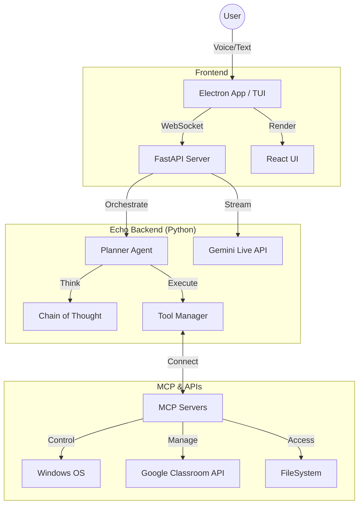

<div align="center">

# Echo
### The Future of Desktop Computing

[](https://python.org)
[](https://www.electronjs.org/)
[](https://deepmind.google/technologies/gemini/)
[](https://modelcontextprotocol.io/introduction)
[](./LICENSE)

<br/>

**Echo is a multimodal AI agent that lives on your desktop.**  
It doesn't just chat—it *acts*. Using advanced speech-to-speech models and the Model Context Protocol (MCP), Echo listens to your voice, understands your intent, and controls your computer to get things done.

[Features](#-features) • [Installation](#-quick-start) • [Architecture](#-architecture) • [Documentation](#-documentation)

</div>

---

##  What is Echo?

Echo bridges the gap between conversational AI and OS-level control. Most assistants are trapped in a browser tab. Echo **integrates with your operating system**, allowing it to:

*   ** See** your screen and understand context.
*   ** Hear** your voice with sub-second latency (Real-time API).
*   ** Act** on your apps, files, and workflows using specialized tools.

Whether you're managing a Google Classroom, automating a complex workflow, or building a presentation, Echo acts as your intelligent co-pilot.

##  Features

###  Native Voice Interaction
Speak naturally. Echo uses **Gemini 2.0 Flash**'s native audio capabilities for fluid, interruptible, human-like conversation. No "wake words" or robotic pauses.

###  Full Desktop Control
Echo isn't limited to APIs. It can use your computer like a human:
*   **App Launching**: "Open VS Code and Spotify."
*   **UI Interaction**: Click, type, scroll, and navigate GUI applications.
*   **Screen Perception**: It "sees" what you see to provide context-aware help.

###  Model Context Protocol (MCP)
Built on the open standard for AI tools. Echo connects to any MCP server:
*   **FileSystem**: Read/Write files safely.
*   **Terminal**: Execute commands and analyze output.
*   **Browser**: Automate web research and tasks.
*   **Custom**: Add your own tools easily.

###  Google Classroom Assistant
A dedicated module for educators:
*   **Course Management**: Create courses, invite students, and manage rosters.
*   **Assignment Automation**: Draft and publish assignments with attachments.
*   **Smart Forms**: Generate quizzes and feedback forms automatically.

###  Transparent Reasoning
Watch Echo "think" in real-time. The UI visualizes the **Chain of Thought (CoT)**, showing you exactly how the agent plans and executes complex tasks step-by-step.

---

##  Architecture

Echo uses a hybrid architecture to combine the best of web technologies and native performance.



---

##  Quick Start

### Prerequisites
*   **Python 3.10+**
*   **Node.js 18+**
*   **Google Gemini API Key** (with Live API access)

### Installation

1.  **Clone the repository**
    ```bash
    git clone https://github.com/your-org/echo-desktop-agent.git
    cd echo-desktop-agent
    ```

2.  **Set up the environment**
    Echo uses `uv` for fast Python package management (optional but recommended).
    ```bash
    # Install dependencies
    pip install -r requirements.txt
    
    # Or with uv
    uv sync
    ```

3.  **Configure Credentials**
    Create a `.env` file in the root directory:
    ```env
    GEMINI_API_KEY=your_api_key_here
    # Optional: For Classroom features
    GOOGLE_CLIENT_ID=...
    GOOGLE_CLIENT_SECRET=...
    ```

### Running Echo

#### Option A: Electron App (Recommended)
The full visual experience with Voice UI and Chain-of-Thought visualization.

```bash
# Terminal 1: Start the backend
python src/backend/main.py

# Terminal 2: Start the UI
cd electron-app
npm install
npm start
```

#### Option B: Terminal Interface (TUI)
A lightweight, hacker-friendly interface for the terminal.

```bash
# Voice Mode (Interactive)
python TUI.py --mode voice

# Fast Command Mode
python TUI.py --command "Open Notepad and type Hello World"
```

---

##  Documentation

*   **[Gemini Live MCP](./gemini_live_mcp/README.md)**: Detailed guide for the web frontend and Google Classroom integration.
*   **[Quickstart Guide](./QUICKSTART.md)**: Extended setup instructions.
*   **[MCP Configuration](./mcp_config.json)**: Configure connected tool servers.

---

##  Project Structure

```
Echo/
├── TUI.py                 # Terminal User Interface entry point
├── electron-app/          # Desktop UI (Node.js/React)
├── gemini_live_mcp/       # Next.js Web Frontend & Classroom Module
├── src/
│   ├── agent/             # Core Agent Logic (Planner, Executor)
│   ├── tools/             # Native Tool Implementations
│   └── utils/             # Helpers for Audio, MCP, Logging
└── tests/                 # Unit and Integration Tests
```

---

##  Contributing

Echo is currently a private research project. Contributions are limited to the core team.

1.  Create a feature branch (`git checkout -b feature/amazing-feature`)
2.  Commit your changes (`git commit -m 'Add amazing feature'`)
3.  Push to the branch (`git push origin feature/amazing-feature`)
4.  Open a Pull Request

---

<div align="center">
  <sub>Built with  by the Echo Team. Powered by Google DeepMind.</sub>
</div>
