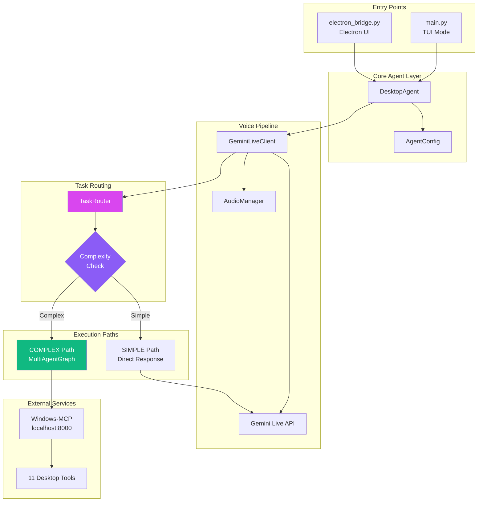
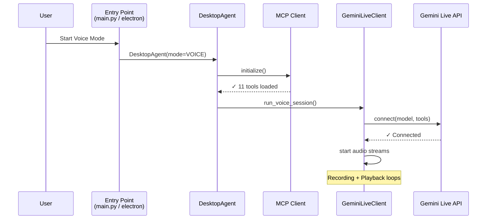
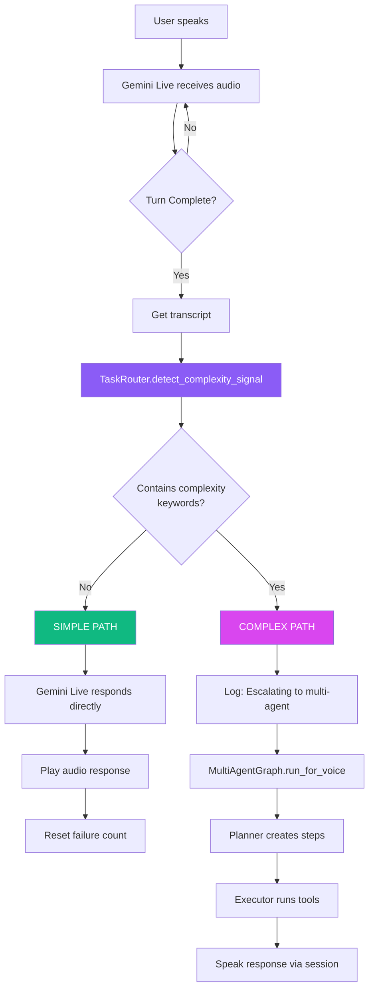
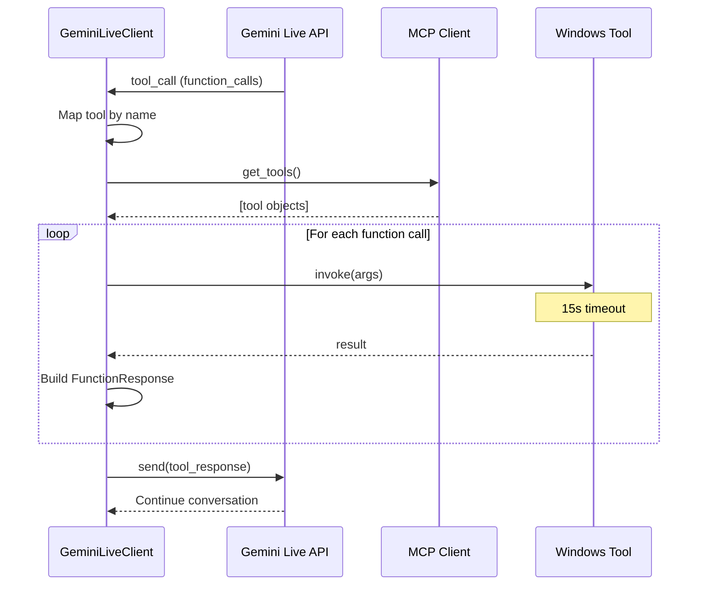

# ECHO Architecture Guide

> Voice-controlled Windows desktop automation with intelligent task routing

## Project Status

> [!IMPORTANT]
> **Last Updated**: January 4, 2026

### Current State

| Component | Status | Notes |
|-----------|--------|-------|
| **FAST Mode** (Gemini Live) | ✅ Working | Real-time voice + MCP tools |
| **REASONING Mode** (MultiAgent) | ⏸️ Paused | Session sync issues with long tasks |
| **Electron UI** | ✅ Working | Mode toggle, hotkey (Alt+Space) |
| **Windows-MCP** | ✅ Working | 11 desktop automation tools |

### Known Issues (REASONING Mode)
- WebSocket timeout during SubAgent execution
- Voice Agent makes random responses while SubAgent works
- Session not synchronized with task execution

### Upcoming: Hybrid Architecture

```
┌─────────────────────────────────────────────────────────────────┐
│                    PLANNED ARCHITECTURE                         │
├─────────────────────────────────────────────────────────────────┤
│                                                                 │
│  FAST Mode (Current)          REASONING Mode (Planned)         │
│  ──────────────────           ─────────────────────────         │
│  Gemini Live API              Whisper + TTS                     │
│  Real-time voice              Capture → Process → Speak        │
│  Single-tool commands         Multi-step planning               │
│  Low latency                  No session timeout issues         │
│                                                                 │
└─────────────────────────────────────────────────────────────────┘
```

**Key Decision**: Use Whisper (STT) + TTS for REASONING mode instead of Gemini Live to avoid session timeout issues during long SubAgent execution.

---

## Overview

ECHO is a voice-controlled desktop assistant that combines real-time audio conversation with Windows automation capabilities. The architecture uses an **EAFP (Easier to Ask Forgiveness than Permission)** pattern for task routing, enabling fast responses for simple commands while seamlessly escalating complex tasks to a multi-agent system.

---

## System Architecture



---

## Code Flow Diagrams

### 1. Voice Session Initialization



### 2. Task Routing Flow (EAFP Pattern)



### 3. Tool Execution Flow



---

## Component Details

### TaskRouter

The TaskRouter uses **keyword heuristics** for instant pre-routing—no LLM classification latency.

```python
# Complexity keywords that trigger multi-agent escalation
complex_keywords = [
    "organize", "sort all", "move all", "find all", "batch",
    "backup", "cleanup", "for each", "every file",
    "create folder", "rename all", "delete all",
    "and then", "after that", "then move"
]
```

| Method | Purpose |
|--------|---------|
| `detect_complexity_signal(transcript)` | Fast keyword matching |
| `should_escalate(transcript, error)` | Error-based escalation |
| `get_routing_strategy(transcript)` | Returns SIMPLE or COMPLEX |
| `reset_failure_count()` | Called after success |

### Entry Points Comparison

| Feature | main.py (TUI) | electron_bridge.py |
|---------|---------------|-------------------|
| UI | Rich console TUI | Electron HTML/CSS |
| Logger | ThinkingLogger + TUI callback | ElectronLogger (stdout) |
| Session Control | Keyboard (Ctrl+C) | IPC (START/STOP commands) |
| Hotkey | None | Alt+Space (global) |
| Code Path | Identical from DesktopAgent onward | Identical from DesktopAgent onward |

---

## Available Tools (via Windows-MCP)

| Tool | Description |
|------|-------------|
| App-Tool | Launch/close applications |
| Powershell-Tool | Execute PowerShell commands |
| State-Tool | Get desktop/window state |
| Click-Tool | Mouse clicks |
| Type-Tool | Keyboard input |
| Scroll-Tool | Scroll operations |
| Drag-Tool | Drag and drop |
| Move-Tool | Move mouse cursor |
| Shortcut-Tool | Keyboard shortcuts |
| Wait-Tool | Timed delays |
| Scrape-Tool | Extract screen content |

---

## File Structure

```
DesktopAgent/
├── main.py                    # TUI entry point
├── electron-app/
│   ├── electron-main.js       # Electron process
│   └── backend/
│       └── electron_bridge.py # Python backend for Electron
├── src/agent/
│   ├── __init__.py           # Exports DesktopAgent, ThinkingLogger
│   ├── llm_agent.py          # DesktopAgent class
│   ├── live_client.py        # GeminiLiveClient + TaskRouter integration
│   ├── task_router.py        # EAFP routing logic
│   ├── state_graph.py        # MultiAgentGraph (LangGraph)
│   ├── planner_agent.py      # Planning node
│   └── executor_agent.py     # Execution node
└── Prompts/
    └── prompts/
        └── echo_voice_tui.txt # System prompt
```

---

## Example Flows

### Simple Command: "Open Notepad"

```
User: "Open Notepad"
↓
GeminiLiveClient receives transcript
↓
TaskRouter.detect_complexity_signal("open notepad") → False
↓
SIMPLE PATH: Gemini Live handles directly
↓
Gemini calls App-Tool: {"appName": "notepad"}
↓
App-Tool returns success
↓
Gemini speaks: "Opening Notepad"
```

### Complex Command: "Organize my downloads by file type"

```
User: "Organize my downloads by file type"
↓
GeminiLiveClient receives transcript
↓
TaskRouter.detect_complexity_signal("organize...") → True (keyword: "organize")
↓
COMPLEX PATH: Escalate to MultiAgentGraph
↓
Planner creates steps:
  1. List files in Downloads
  2. Group by extension
  3. Create folders (Documents, Images, etc.)
  4. Move files to respective folders
↓
Executor runs each step via MCP tools
↓
Response spoken back to user
```

---

## Testing

Run integration tests:

```bash
uv run pytest tests/test_task_router_integration.py -v
```

Tests cover:
- Classification (SIMPLE vs COMPLEX)
- Escalation logic (error-based + failure counting)
- Entry point imports
- Routing behavior with mocks
