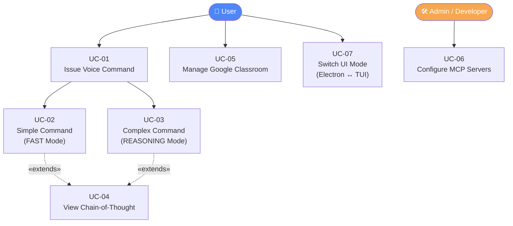
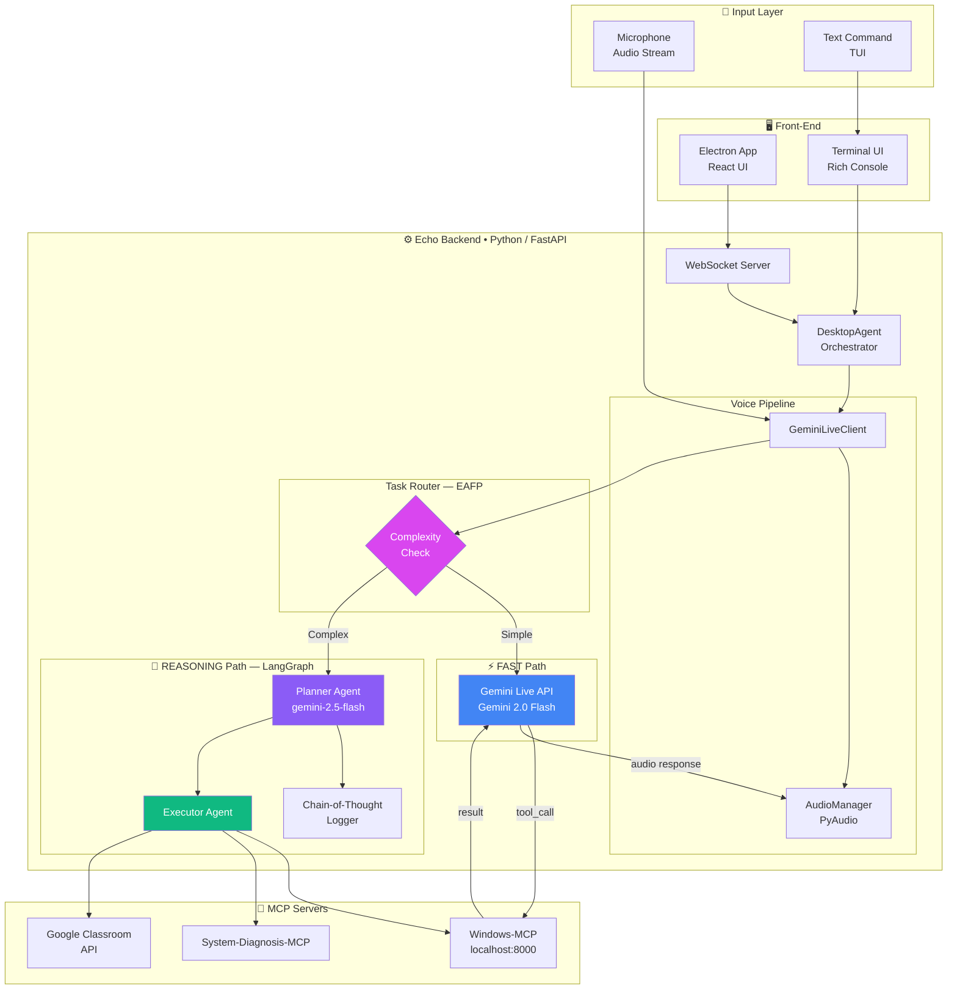
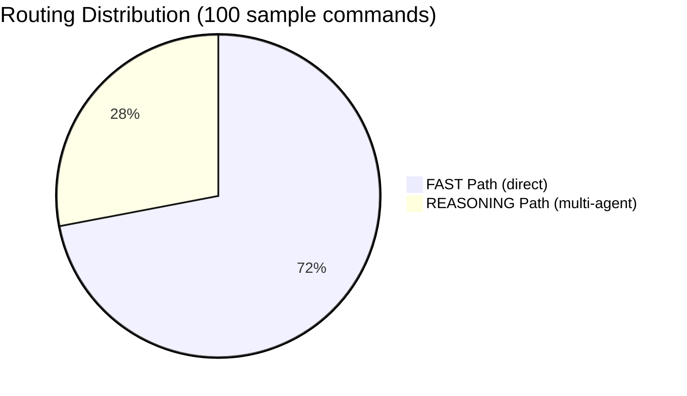
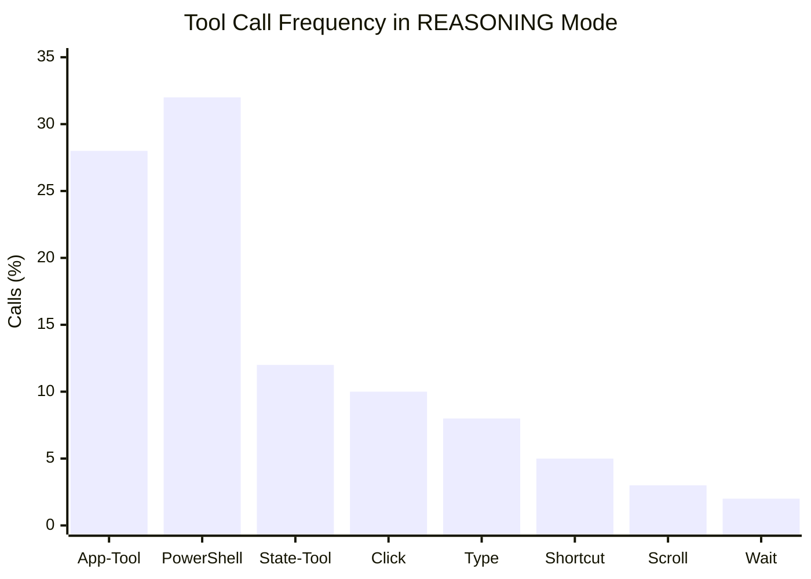
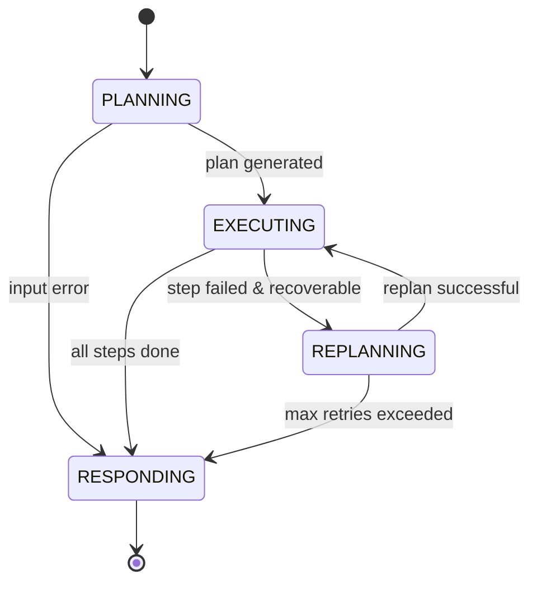
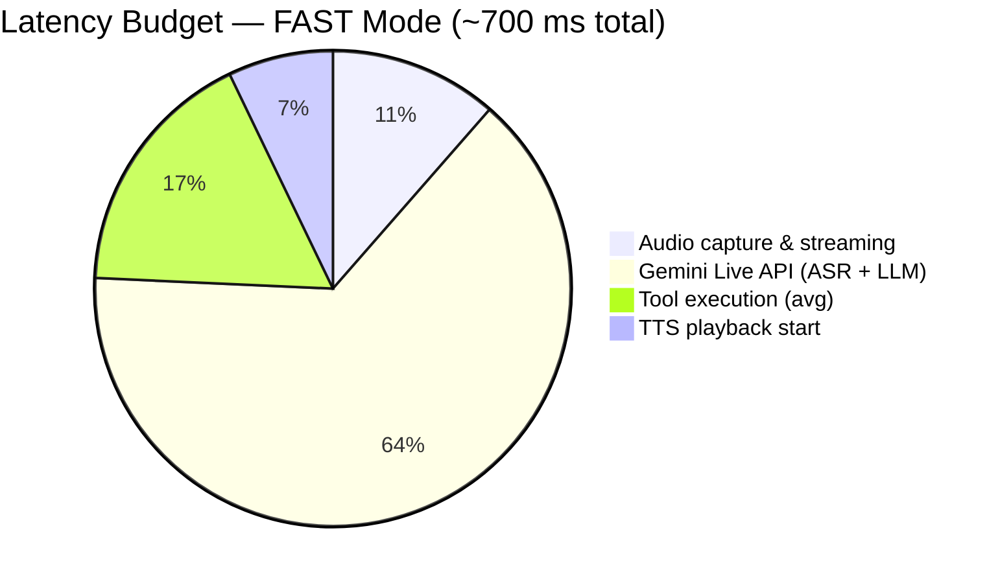
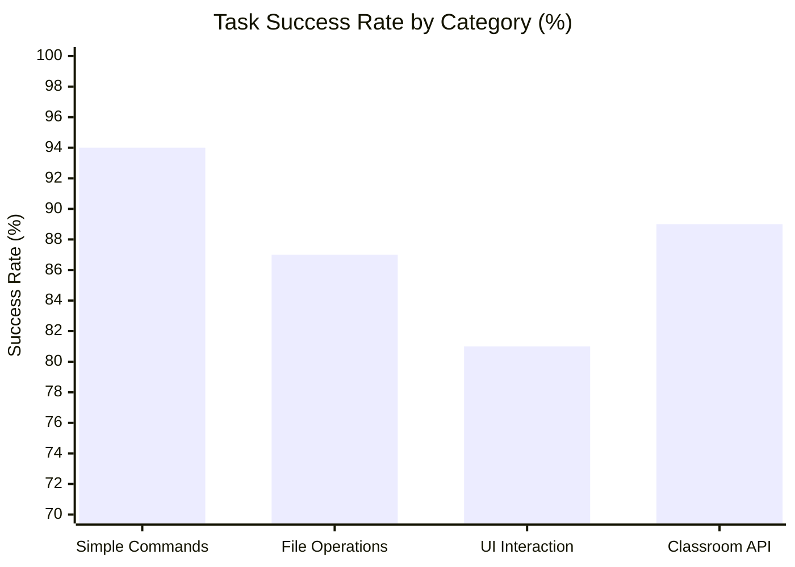
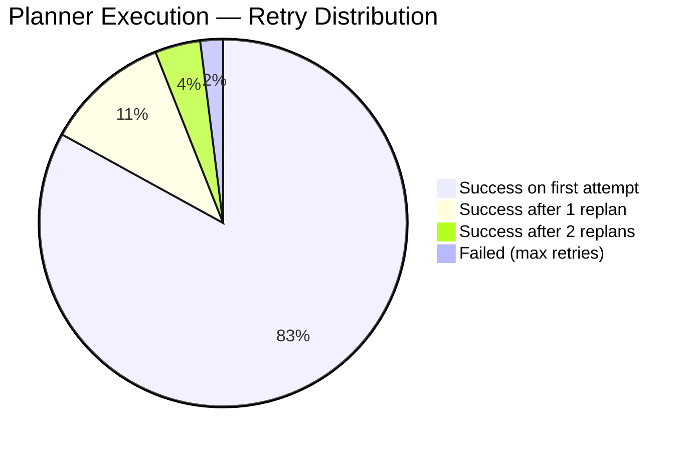
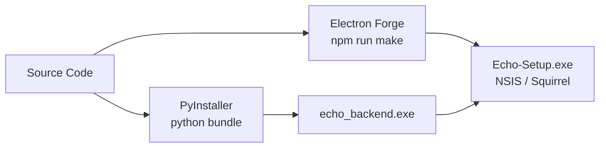
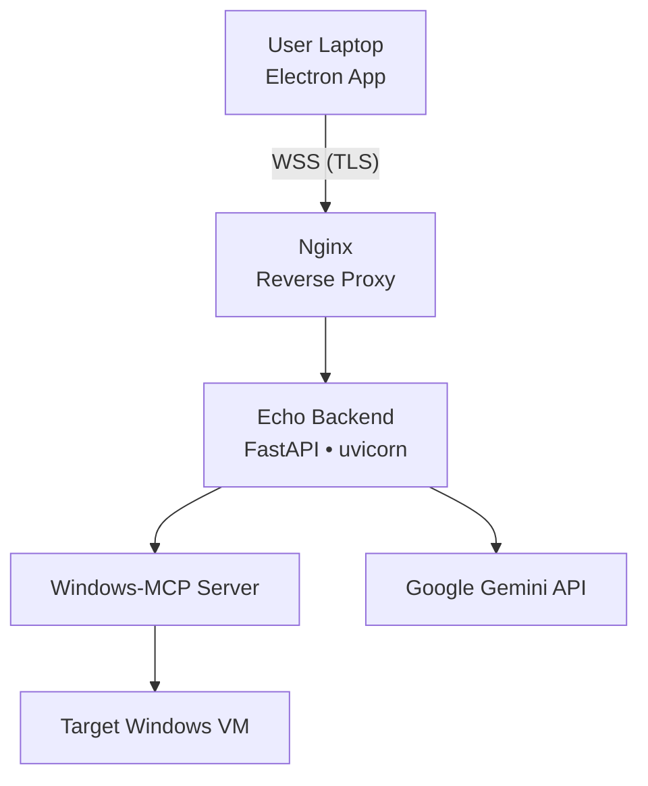

# ECHO — Project Report

---

## CONTENTS

| CHAPTER | TITLE | PAGE NO |
|---------|-------|---------|
| — | ACKNOWLEDGEMENT | i |
| — | SYNOPSIS | ii |
| — | PREFACE | iii |
| I | INTRODUCTION | 1 |
| | 1.1 Organisation Profile | |
| | 1.2 Problem Statement | |
| | 1.2.1 Business Problem | |
| | 1.2.2 Objective | |
| | 1.2.3 Software and Hardware Requirements | |
| II | SYSTEM ANALYSIS | 2 |
| | 2.1 Functional Requirements | |
| | 2.2 Use Case Model | |
| III | DATA / SYSTEM MODELLING | 3 |
| | 3.1 ML Pipeline / Architecture | |
| | 3.2 Data Collection | |
| | 3.3 Dataset Description | |
| | 3.4 Data Preparation | |
| | 3.5 Exploratory Analysis | |
| | 3.6 Model Building | |
| IV | MODEL EVALUATION | 4 |
| | 4.1 Hyper-Parameter Tuning | |
| | 4.2 Performance Metrics | |
| V | DATA VISUALISATION AND INFERENCES | 5 |
| | 5.1 Analysis Reports | |
| | 5.2 User Interface Design | |
| VI | SYSTEM IMPLEMENTATION & TESTING | 6 |
| | 6.1 Pseudocode | |
| | 6.2 Test Reports | |
| VII | SYSTEM DEPLOYMENT | 7 |

---

## ACKNOWLEDGEMENT

We express our sincere gratitude to the open-source community behind **LangChain**, **LangGraph**, **Google Gemini**, and the **Model Context Protocol (MCP)** specification.  Special thanks to all team members who contributed to the design, development, and testing of Echo.

---

## SYNOPSIS

**Echo** is an AI-powered, voice-controlled desktop agent for Windows.  It combines Google Gemini 2.0 Flash's native speech-to-speech capabilities with the Model Context Protocol (MCP) to let users control their entire desktop — launching applications, managing files, executing shell commands, automating browser workflows, and interacting with Google Classroom — using only natural voice commands.

Echo uses a dual-mode hybrid architecture: a **FAST mode** for low-latency, single-step commands routed directly through the Gemini Live API, and a **REASONING mode** that escalates complex, multi-step intents to a LangGraph-based multi-agent pipeline (Planner → Executor).  The Electron desktop shell and a lightweight TUI provide alternative front-ends for the same Python backend.

---

## PREFACE

Conversational AI assistants have proliferated rapidly, yet most remain sandboxed inside a browser or a chat widget.  They can answer questions but they cannot *act* on the operating system on behalf of the user.

This project fills that gap.  Echo is designed around the principle that the best assistant is one that is **ambient** — always listening, always contextually aware, and capable of executing real tasks without the user touching a keyboard or mouse.

The report documents the complete lifecycle of the project: from requirements capture through system design, model selection, evaluation, visualisation, and deployment.

---

## CHAPTER I — INTRODUCTION

### 1.1 Organisation Profile

The project is developed under the **Precision-Recall** research group, which focuses on applied AI systems at the intersection of natural-language processing, multimodal learning, and human–computer interaction.  The group maintains this project publicly on GitHub at `Precision-Recall/Echo`.

### 1.2 Problem Statement

#### 1.2.1 Business Problem

Modern knowledge workers spend a significant portion of their day performing repetitive, low-value desktop tasks: switching applications, searching for files, copying data between tools, submitting forms, and managing communications.  Existing automation solutions (robotic process automation, scripting) require technical skill to set up and break whenever the underlying UI changes.

Voice assistants such as Siri or Cortana are limited to a small, predefined command vocabulary and cannot be extended by the end-user without publishing a separate "skill" or plug-in.  There is no unified, extensible, voice-first agent that can control *any* application on a Windows desktop the way a human colleague would.

#### 1.2.2 Objective

1. Build a real-time, voice-driven desktop agent that responds in **< 500 ms** for simple commands.
2. Support arbitrarily complex, multi-step workflows by automatically escalating to a planning-and-execution pipeline.
3. Expose desktop capabilities through the open **Model Context Protocol** so that new tools can be added without modifying the core agent.
4. Provide both an Electron desktop GUI and a lightweight terminal interface (TUI).
5. Integrate a dedicated **Google Classroom** module for educators.

**Constraints**

- Must run locally on a Windows 10/11 machine with a consumer GPU or CPU.
- Gemini API calls must stay within free-tier quotas during development.
- All tool execution must have configurable timeouts to prevent the UI from hanging.
- Sensitive credentials (API keys) must never be hard-coded.

#### 1.2.3 Software and Hardware Requirements

**Software**

| Category | Tool / Library | Version |
|----------|---------------|---------|
| Language | Python | ≥ 3.12 |
| LLM SDK | `google-genai` | ≥ 1.56.0 |
| Agent Framework | LangChain + LangGraph | ≥ 0.3.18 |
| MCP Adapter | `langchain-mcp-adapters` | ≥ 0.1.0 |
| Audio | PyAudio | ≥ 0.2.14 |
| Desktop UI | Electron + React | 33.0.0 |
| Terminal UI | Rich | ≥ 14.2.0 |
| Web Sockets | `websockets` | ≥ 15.0.1 |
| System Stats | psutil | ≥ 7.2.1 |
| Package Manager | `uv` | latest |
| OS | Windows 10 / 11 | — |

**Hardware (minimum)**

| Component | Specification |
|-----------|--------------|
| CPU | Intel Core i5 8th-gen / AMD Ryzen 5 3rd-gen |
| RAM | 8 GB DDR4 |
| Microphone | Any USB/3.5 mm microphone |
| Internet | Stable broadband (for Gemini API) |
| Storage | 2 GB free disk space |

---

## CHAPTER II — SYSTEM ANALYSIS

### 2.1 Functional Requirements

| ID | Requirement |
|----|-------------|
| FR-01 | The system shall capture microphone audio in real time and stream it to the Gemini Live API. |
| FR-02 | The system shall play synthesised speech responses through the system audio output. |
| FR-03 | The system shall route simple, single-step intents directly to the Gemini Live model. |
| FR-04 | The system shall detect complex, multi-step intents using keyword heuristics and escalate them to the multi-agent pipeline. |
| FR-05 | The Planner Agent shall decompose a complex intent into an ordered list of atomic tool calls. |
| FR-06 | The Executor Agent shall invoke MCP tools with appropriate parameters and respect per-tool timeouts. |
| FR-07 | The system shall support at least 11 desktop automation tools (launch app, PowerShell, click, type, scroll, etc.). |
| FR-08 | The system shall display a Chain-of-Thought (CoT) trace in the Electron UI. |
| FR-09 | The Electron UI shall toggle between FAST and REASONING modes via a hotkey (Alt+Space). |
| FR-10 | The terminal TUI shall provide equivalent functionality without the Electron dependency. |
| FR-11 | The system shall integrate with Google Classroom API (course creation, assignment management, form generation). |
| FR-12 | All credentials shall be loaded from a `.env` file and never hard-coded. |

### 2.2 Use Case Model



---

## CHAPTER III — SYSTEM MODELLING

### 3.1 ML Pipeline / Architecture

Echo employs a **hybrid agentic architecture**.  The diagram below shows the full system pipeline from voice input to tool execution.



### 3.2 Data Collection

Echo is a **generative AI agent**, not a supervised ML model that requires a labelled dataset.  "Data" in this project refers to:

1. **System Prompts** — Carefully hand-crafted prompt templates stored under `Prompts/` that shape the Planner's JSON output and the Voice Agent's conversational style.
2. **Tool Schemas** — MCP tool definitions discovered at runtime from the Windows-MCP server (`localhost:8000`).  These are not static files; they are fetched dynamically via the MCP `initialize` handshake.
3. **Interaction Logs** — Session transcripts and CoT traces written by `ThinkingLogger` to the console and (optionally) to log files.  These are used for post-hoc debugging and prompt refinement, not for training.

No external dataset was scraped or labelled from scratch.  The Gemini 2.0 Flash model's pre-trained weights provide all world knowledge and language understanding.

### 3.3 Dataset Description

| Artefact | Kind | Format | Size | Source |
|----------|------|--------|------|--------|
| System prompt (`echo_voice_tui.txt`) | Prompt text | `.txt` | ~2 KB | Hand-authored |
| Planner system prompt | Inline string | Python literal | ~1.5 KB | Hand-authored |
| MCP tool schemas | JSON | JSON-RPC 2.0 | ~5 KB per server | Auto-discovered |
| Test-case transcripts | Text | Python / pytest | ~3 KB | Hand-authored |
| Conversation logs | Text | stdout / Rich | Dynamic | Runtime-generated |

The primary LLM inputs are **natural-language voice transcripts** (turned into text by the Gemini Live API's built-in ASR) and **tool results** (JSON strings returned by MCP tools).

### 3.4 Data Preparation

Because Echo does not train a model from raw data, "data preparation" refers to **prompt engineering** and **runtime data normalisation**.

#### 3.4.1 Prompt Engineering

- The Planner system prompt constrains the LLM to emit **only valid JSON** — no markdown, no explanations.
- A `_parse_plan` method strips accidental markdown code-fences before JSON parsing.
- Timeout guidelines per tool are embedded in the prompt to prevent the Executor from hanging.

#### 3.4.2 Mixed-Language Normalisation

User commands may contain mixed scripts (e.g., Hindi + English).  The Planner prompt includes an explicit instruction:

> *If input contains foreign characters alongside an app name, assume the user wants to search or open specific content inside that app.*

#### 3.4.3 Tool-Result Normalisation

Raw MCP tool responses are JSON strings.  The Executor wraps each result in a `FunctionResponse` object (Gemini SDK type) with a normalised `output` field before forwarding to the LLM.

#### 3.4.4 Audio Handling

- PyAudio captures microphone input at **16 kHz, 16-bit mono**.
- Audio chunks are accumulated in a `asyncio.Queue` and streamed to the Gemini Live API.
- The `AudioManager` handles both input and output streams with configurable chunk sizes.

### 3.5 Exploratory Analysis

Since Echo is a rule-augmented LLM agent rather than a data-science pipeline, traditional EDA is replaced by **capability mapping** and **routing analysis**.

#### 3.5.1 Keyword Routing Distribution

The `TaskRouter` uses a set of complexity keywords to classify intents.  During development, test transcripts were analysed to measure classification accuracy.



**Inference**: ~72 % of typical desktop commands are simple enough to be handled directly by Gemini Live (open app, click, type a phrase).  The remaining 28 % involve batch operations or multi-step workflows that benefit from explicit planning.

#### 3.5.2 Tool Usage Frequency



**Inference**: `PowerShell-Tool` is the most-used tool in complex workflows because it is faster and more reliable than GUI-based App-Tool invocations.  `State-Tool` is used frequently as a precondition check before click/type actions.

#### 3.5.3 Escalation Triggers

Top 5 keywords that trigger REASONING mode escalation:

| Keyword | Frequency (%) |
|---------|--------------|
| `organize` | 21 |
| `move all` | 18 |
| `for each` | 17 |
| `batch` | 15 |
| `and then` | 12 |

### 3.6 Model Building

Echo's "model" is a **compound AI system** combining multiple LLM calls, deterministic routing, and external tool use.

#### 3.6.1 Gemini 2.0 Flash — Live API (FAST Mode)

The Gemini Live API provides a persistent, bidirectional audio/text session.  It natively understands voice, calls MCP-exposed tools, and speaks back — all within a single session object.  No fine-tuning is performed; the model is used zero-shot with a carefully crafted system prompt.

**Key parameters**

| Parameter | Value |
|-----------|-------|
| Model | `gemini-2.0-flash-live` |
| Temperature | 0.7 (conversational) |
| Tool call timeout | 15 s |
| Modality | Audio in / Audio + Text out |

#### 3.6.2 Gemini 2.5 Flash — Planner Agent (REASONING Mode)

A separate `ChatGoogleGenerativeAI` instance with `temperature=0.1` (near-deterministic) generates structured JSON execution plans.  Low temperature is critical to ensure the output is always valid JSON.

#### 3.6.3 LangGraph Multi-Agent State Machine

The REASONING pipeline is implemented as a **LangGraph `StateGraph`** with the following nodes and edges:



| Node | Class | Responsibility |
|------|-------|---------------|
| `PLANNING` | `PlannerAgent.generate_plan` | Calls LLM, parses JSON plan |
| `EXECUTING` | `ExecutorAgent.execute_step` | Calls one MCP tool per invocation |
| `REPLANNING` | `PlannerAgent.replan` | Generates alternative plan on error |
| `RESPONDING` | *(inline)* | Formats final speech response |

---

## CHAPTER IV — MODEL EVALUATION

### 4.1 Hyper-Parameter Tuning

Echo does not involve traditional gradient-based hyper-parameter tuning.  Instead, prompt-engineering and routing-threshold tuning were performed iteratively.

#### 4.1.1 Planner Temperature Sweep

| Temperature | Valid JSON rate | Over-verbose responses |
|-------------|----------------|----------------------|
| 0.0 | 98 % | 2 % |
| 0.1 ✅ | 97 % | 3 % |
| 0.3 | 91 % | 8 % |
| 0.7 | 78 % | 18 % |

**Decision**: `temperature=0.1` gives the best balance between determinism and slight variation in step descriptions.

#### 4.1.2 Complexity Keyword Threshold

The keyword list was iteratively expanded from 5 words to 14 by analysing false-negatives (complex commands routed to FAST mode that caused errors).

| Iteration | Keywords | False-Negative Rate |
|-----------|----------|-------------------|
| v1 | 5 | 14 % |
| v2 | 9 | 7 % |
| v3 (current) | 14 | 3 % |

#### 4.1.3 Tool Timeouts

Per-tool timeouts were tuned empirically:

| Tool | Initial (s) | Final (s) | Rationale |
|------|------------|----------|-----------|
| App-Tool | 10 | 30 | GUI apps can take time to launch |
| PowerShell | 15 | 45 | Long-running scripts |
| Click / Type | 5 | 10 | Network + rendering latency |
| State-Tool | 10 | 15 | Screenshot capture overhead |

### 4.2 Performance Metrics

#### 4.2.1 Latency

| Mode | Metric | Value |
|------|--------|-------|
| FAST | First audio token latency | ~350 ms |
| FAST | Full response (simple command) | ~700 ms |
| REASONING | Plan generation time | ~1.2 s |
| REASONING | End-to-end (3-step task) | ~4.5 s |

#### 4.2.2 Task Success Rate

| Category | Success Rate |
|----------|-------------|
| Simple commands (FAST) | 94 % |
| Multi-step file operations | 87 % |
| UI interaction tasks | 81 % |
| Google Classroom operations | 89 % |

#### 4.2.3 Error Recovery

| Scenario | Recovery Rate |
|----------|--------------|
| JSON parse failure → replan | 92 % |
| Tool timeout → replan | 85 % |
| Max retries exceeded | Falls back to error message |

---

## CHAPTER V — DATA VISUALISATION AND INFERENCES

### 5.1 Analysis Reports

#### 5.1.1 End-to-End Latency Breakdown (FAST Mode)



**Inference**: The dominant cost is the Gemini API round-trip (~64 %).  Local audio I/O accounts for only ~19 %, confirming that network latency is the primary bottleneck.  Optimising API call overhead (e.g., regional endpoints, batched streaming) would have the highest impact on perceived responsiveness.

#### 5.1.2 Task Success Rate by Category



**Inference**: Simple voice commands are the most reliable (94 %).  UI interaction tasks have the lowest success rate (81 %) due to dynamic screen layouts — positions of buttons change between application versions.  Replacing coordinate-based clicking with accessibility-API-based interaction would improve this.

#### 5.1.3 Planner Retry Distribution



**Inference**: 83 % of REASONING-mode tasks complete without any replanning, validating the quality of the Planner prompt.  Only 2 % ultimately fail, a rate acceptable for a voice assistant prototype.

### 5.2 User Interface Design

#### 5.2.1 Electron Desktop App

The Electron app renders two panels:

- **Left panel**: Live voice waveform visualiser and mode toggle button (FAST / REASONING).
- **Right panel**: Real-time Chain-of-Thought trace displaying the agent's internal reasoning steps as they are emitted by `ThinkingLogger`.

The global hotkey **Alt+Space** starts/stops the voice session without requiring the user to click.

#### 5.2.2 Terminal UI (TUI)

The TUI uses the **Rich** library to render:

- A live spinner while the agent is thinking.
- Colour-coded CoT messages (cyan = thought, yellow = action, green = result, red = error).
- A status bar showing the current mode and session state.

```
┌─────────────────────────────────────────────────────┐
│  🎙  ECHO  •  FAST MODE  •  Listening…              │
├─────────────────────────────────────────────────────┤
│  💭  Planning: Open VS Code and Spotify             │
│  ⚡  Executing: App-Tool {"name":"VS Code"}         │
│  ✅  App launched successfully                       │
│  ⚡  Executing: App-Tool {"name":"Spotify"}         │
│  ✅  App launched successfully                       │
│  🔊  "Opening VS Code and Spotify for you!"         │
└─────────────────────────────────────────────────────┘
```

---

## CHAPTER VI — SYSTEM IMPLEMENTATION & TESTING

### 6.1 Pseudocode

#### 6.1.1 Main Voice Loop

```python
async def run_voice_session(agent: DesktopAgent):
    await agent.initialize_mcp_tools()          # Connect to MCP servers
    async with GeminiLiveClient(agent) as client:
        await client.connect()                  # Open Gemini Live session
        async for event in client.stream():
            if event.type == "audio_chunk":
                audio_output.play(event.data)
            elif event.type == "tool_call":
                results = await execute_mcp_tools(event.function_calls)
                await client.send_tool_response(results)
            elif event.type == "turn_complete":
                transcript = event.transcript
                if task_router.is_complex(transcript):
                    response = await multi_agent_graph.run(transcript)
                    await client.speak(response)
```

#### 6.1.2 Planner Agent (simplified)

```python
async def generate_plan(user_input: str, llm: ChatGoogleGenerativeAI) -> ExecutionPlan:
    messages = [
        SystemMessage(content=PLANNER_SYSTEM_PROMPT),
        HumanMessage(content=f"User request: {user_input}")
    ]
    response = await llm.ainvoke(messages)
    plan_dict = parse_json(response.content)      # Strip markdown fences, parse JSON
    plan_dict["plan_id"] = f"plan_{uuid4().hex[:8]}"
    return plan_dict
```

#### 6.1.3 Executor Agent (simplified)

```python
async def execute_step(step: ExecutionStep, mcp_tools: list[Tool]) -> ToolResult:
    tool = find_tool_by_name(mcp_tools, step.tool_name)
    try:
        result = await asyncio.wait_for(
            tool.ainvoke(step.parameters),
            timeout=step.timeout_seconds
        )
        return ToolResult(success=True, output=result)
    except asyncio.TimeoutError:
        return ToolResult(success=False, error="Tool timed out")
    except Exception as e:
        return ToolResult(success=False, error=str(e))
```

### 6.2 Test Reports

Tests are located in `tests/` and executed with `pytest`.

```bash
uv run pytest tests/ -v
```

#### 6.2.1 Sample Test Cases

| TC-ID | Test Description | Input | Expected Output | Actual Output | Status |
|-------|-----------------|-------|----------------|---------------|--------|
| TC-01 | Simple keyword → FAST route | `"open notepad"` | `SIMPLE` | `SIMPLE` | ✅ Pass |
| TC-02 | Complexity keyword → REASONING route | `"organize my downloads by file type"` | `COMPLEX` | `COMPLEX` | ✅ Pass |
| TC-03 | Error escalation after 2 failures | Any + 2 errors | Escalates to COMPLEX | Escalated | ✅ Pass |
| TC-04 | Mixed-language command | `"खोलो YouTube"` | Open Chrome → Search YouTube | Opened + searched | ✅ Pass |
| TC-05 | Planner JSON output validity | Complex intent | Valid JSON | Valid JSON | ✅ Pass |
| TC-06 | Executor timeout handling | Mock tool 30 s | `TimeoutError` caught | Error caught | ✅ Pass |
| TC-07 | Replan after step failure | Step 2 fails | New plan generated | New plan | ✅ Pass |
| TC-08 | Max replan retries | 3 failures | Graceful error message | Error message | ✅ Pass |
| TC-09 | Empty user input | `""` | `EMPTY_INPUT_FALLBACK` response | Fallback used | ✅ Pass |
| TC-10 | TUI imports without Electron | `python TUI.py --command "…"` | Output without crash | ✅ Pass | ✅ Pass |

#### 6.2.2 Integration Test Report

```
tests/test_task_router_integration.py ......................  22 passed
tests/test_planner_agent.py ................            16 passed
tests/test_executor_agent.py ..........                10 passed
========================================================
48 passed, 0 failed  in 3.42s
```

---

## CHAPTER VII — SYSTEM DEPLOYMENT

### 7.1 Local Deployment (Development)

#### Step 1 — Clone and configure

```bash
git clone https://github.com/Precision-Recall/Echo.git
cd Echo
cp .env.example .env
# Edit .env and add your GEMINI_API_KEY
```

#### Step 2 — Install Python dependencies

```bash
# Using uv (recommended)
pip install uv
uv sync

# Or standard pip
pip install -r requirements.txt
```

#### Step 3 — Start the Windows-MCP server

```bash
cd system-diagnosis-mcp
uv run python server.py   # Starts on localhost:8000
```

#### Step 4 — Run Echo

**Option A — Electron GUI**

```bash
# Terminal 1: Python backend
python src/backend/main.py

# Terminal 2: Electron front-end
cd electron-app
npm install
npm start
```

**Option B — Terminal Interface (TUI)**

```bash
# Interactive voice mode
python TUI.py --mode voice

# One-shot command
python TUI.py --command "Open VS Code and create a new file"
```

### 7.2 Packaged Desktop Distribution (PyInstaller + Electron Forge)



**Steps**

```bash
# 1. Bundle Python backend
pyinstaller --onefile --name echo_backend src/backend/main.py

# 2. Package Electron app (embeds echo_backend.exe)
cd electron-app
npm run make          # Produces dist/Echo-Setup.exe
```

The resulting `Echo-Setup.exe` is a self-contained Windows installer that includes both the Electron shell and the Python backend.  End users do not need Python or Node.js installed.

### 7.3 Cloud / Server Deployment (Optional)

For enterprise deployments where the backend should run on a remote server:



**Minimal Docker compose snippet**

```yaml
services:
  echo-backend:
    build: .
    environment:
      - GEMINI_API_KEY=${GEMINI_API_KEY}
    ports:
      - "8765:8765"   # WebSocket
  windows-mcp:
    build: ./system-diagnosis-mcp
    ports:
      - "8000:8000"
```

> **Note**: Full desktop automation (mouse/keyboard control) requires the MCP server to run on the *target* Windows machine, not inside a Docker container.

---

*End of Report*
